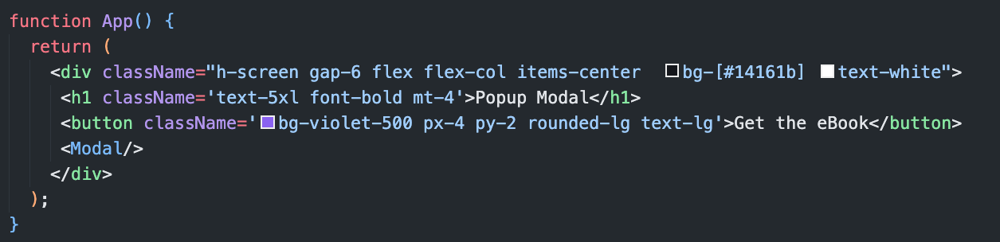
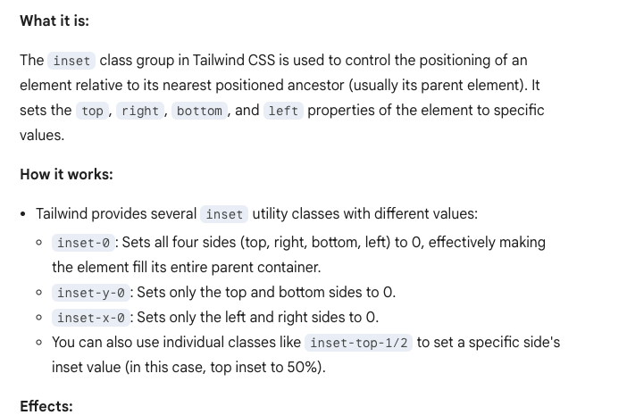
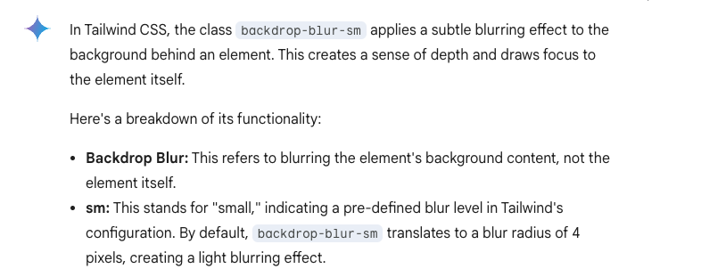
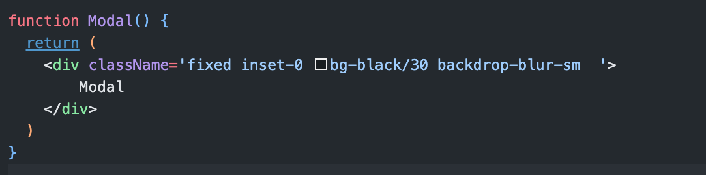
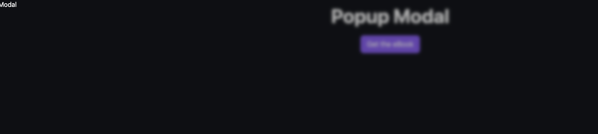

# Installing the tailwind

# steps:

- Create the UI/wireframe using the tailwind
- Now for the modal part create a component -> Modal.js
- Show the modal component below the UI as shown. Now we need to add the condition

# to achieve the modal effect following property is used

- we want modal component to cover the whole screen. so for that we will give it a `inset-0` css

- The `backdrop-blur-sm` class in Tailwind CSS applies a blur effect to the area behind an element.

- Effect of using both above property is

 

- In the modal page we have used lucid react library for the cross icon
